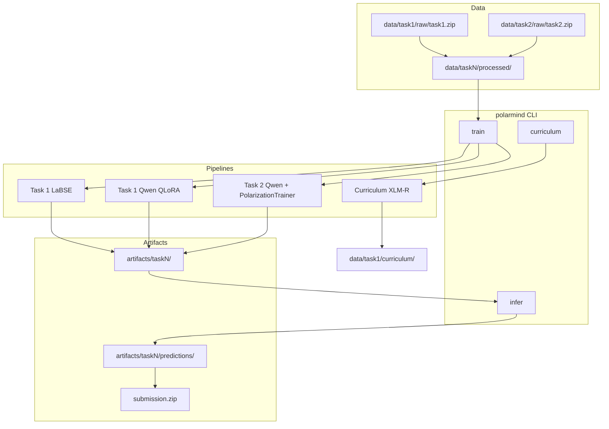
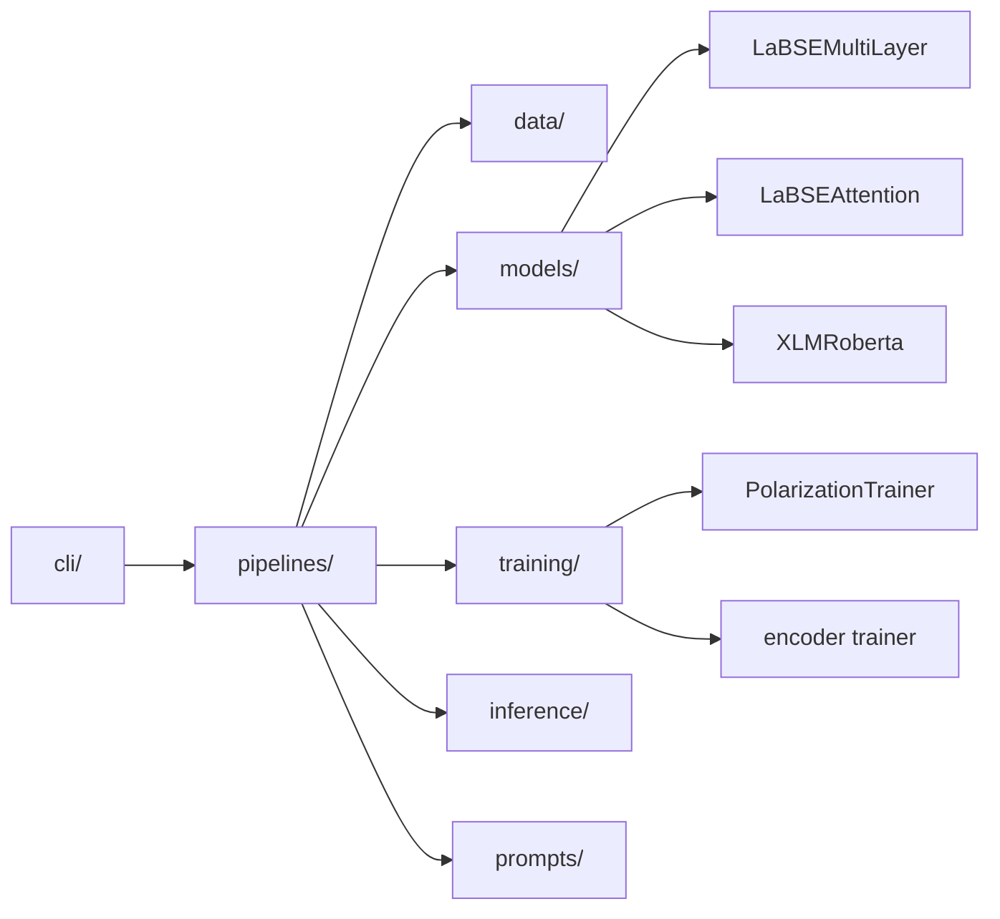
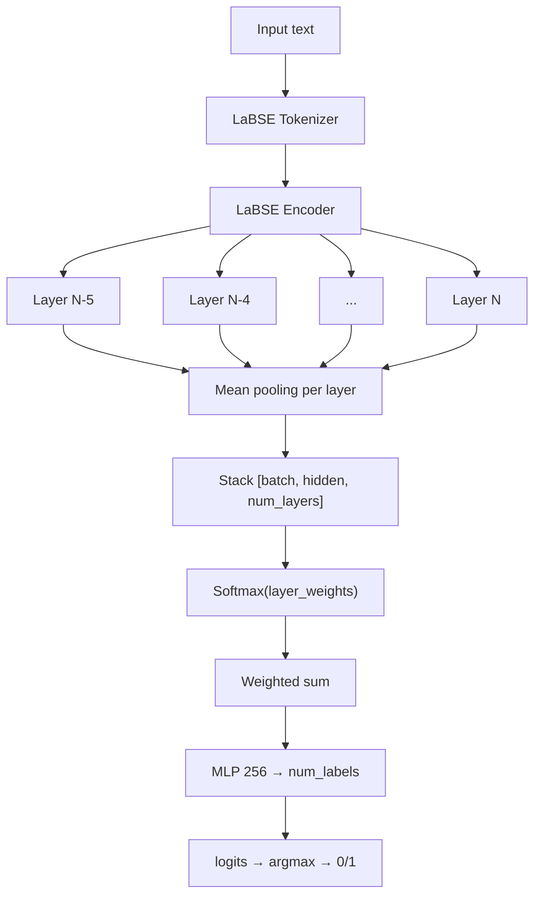
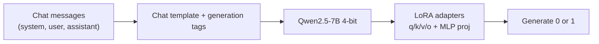
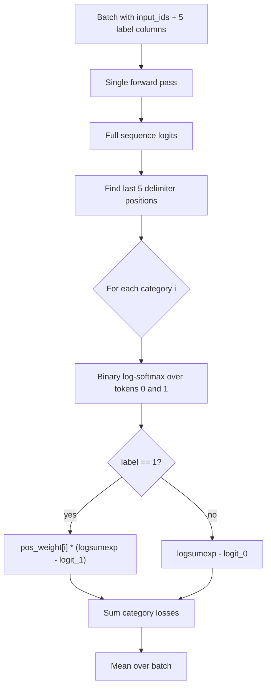
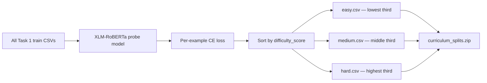
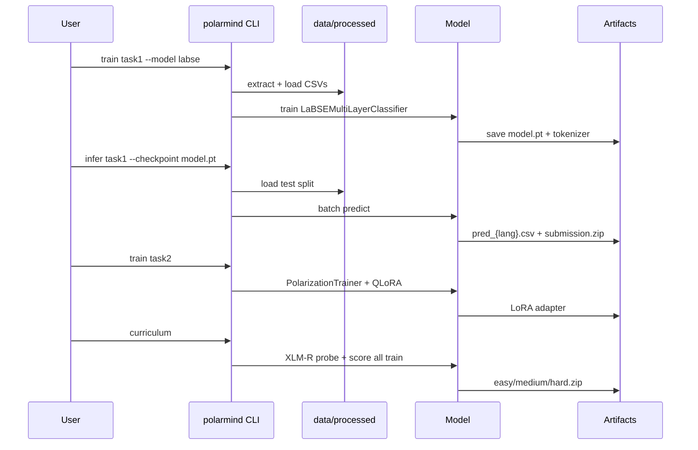

# PolarMind

<<<<<<< HEAD
<<<<<<< HEAD
**Multilingual polarization detection** (binary + fine-grained multi-label).
=======
**Multilingual polarization detection** using encoder classifiers, instruction-tuned LLMs, and custom token-level supervision.
>>>>>>> parent of a030ce8 (Refactor README.md to streamline project description and task details. Consolidate language support information and clarify task labels for polarization detection. Remove outdated sections to enhance readability.)

PolarMind targets two related NLP tasks: deciding whether text is polarized at all (binary), and identifying *which type* of polarization it expresses (multi-label). The codebase supports **22 languages** for binary detection and **7 languages** for fine-grained categorization, with approaches ranging from lightweight LaBSE encoders to Qwen 2.5 QLoRA fine-tuning.

---

## Table of contents

1. [Problem overview](#problem-overview)
2. [Research ideas and design philosophy](#research-ideas-and-design-philosophy)
3. [System architecture](#system-architecture)
4. [Task 1: Binary polarization](#task-1-binary-polarization)
5. [Task 2: Fine-grained multi-label](#task-2-fine-grained-multi-label)
6. [Curriculum learning pipeline](#curriculum-learning-pipeline)
7. [Repository layout](#repository-layout)
8. [Installation](#installation)
9. [Data preparation](#data-preparation)
10. [Usage](#usage)
11. [Configuration](#configuration)
12. [Python API](#python-api)
13. [Model reference](#model-reference)
14. [Reported results](#reported-results)
15. [Environment variables](#environment-variables)
16. [License](#license)

---

## Problem overview

Social media and news text can be polarizing along several dimensions. PolarMind addresses this at two levels:

| Task | Question | Languages | Labels |
|------|----------|-----------|--------|
| **Task 1** | Is this text polarized? | 22 | `polarization` ∈ {0, 1} |
| **Task 2** | What *kind* of polarization? | 7 | Five binary columns |

**Task 2 categories**

| Column | Description |
|--------|-------------|
| `political` | Political polarization |
| `racial/ethnic` | Racial or ethnic polarization |
| `religious` | Religious polarization |
| `gender/sexual` | Gender or sexual polarization |
| `other` | Other forms not covered above |

**Supported language codes (Task 1):**  
`amh`, `arb`, `ben`, `mya`, `eng`, `deu`, `hau`, `hin`, `ita`, `khm`, `nep`, `ori`, `fas`, `pol`, `pan`, `rus`, `spa`, `swa`, `tel`, `tur`, `urd`, `zho`

**Supported language codes (Task 2):**  
`eng`, `deu`, `ita`, `spa`, `pol`, `rus`, `tur`

---

## Research ideas and design philosophy

These ideas drove the original experiments and are baked into the current implementation.

### 1. Multi-layer representation aggregation

Rather than using only the final transformer layer, PolarMind pools the **last N hidden states** and combines them with **learnable layer weights** (softmax-normalized). Deeper layers capture different levels of semantics; letting the model learn which layers matter most per task often outperforms single-layer CLS or mean pooling alone.

### 2. Delimiter-token supervision for multi-label LLMs (core Task 2 idea)

A naive approach would ask Qwen to generate labels like `political, racial, religious` as free text. That fails for categories an encoder cannot interpret intuitively — especially **"other"**.

**Our approach:** structure the prompt so each category ends with a fixed delimiter (` ::` or `)%`), then supervise only the **next-token distribution over `0` and `1`** at those positions:

```
political polarisation (1/0) ::
racial polarisation (1/0) ::
...
```

During training, `PolarizationTrainer` locates the last five delimiter positions in the sequence and applies a **binary cross-entropy-style loss** on the logits for tokens `0` and `1` at each position — without requiring the model to generate readable category names.

At inference, prediction is: **predict 1 if P(1) > P(0)** (optionally with per-category probability thresholds).

### 3. Class imbalance via `pos_weight`

Polarization labels are heavily skewed (many more 0s than 1s, varying per category). For each of the five Task 2 columns we compute:

```
pos_weight[i] = neg_count[i] / (pos_count[i] + ε)
```

Positive labels receive a higher loss contribution, preventing the model from collapsing to all-zeros.

### 4. Language-aware multilingual training

For cross-lingual generalization, two language-token strategies were explored:

| Token format | Model | Example |
|--------------|-------|---------|
| `<lang=eng>` | Qwen (Task 2) | Prepended as special tokens; embeddings resized |
| `[LANG_eng]` | LaBSE attention | Prepended to text; tokenizer vocabulary extended |

This tells the model which language it is reading without training separate heads per language.

### 5. Encoder vs. generative trade-off

| Approach | Strength | Cost |
|----------|----------|------|
| **LaBSE / XLM-R encoder** | Fast, works on CPU, strong baseline | Less flexible prompting |
| **Qwen + QLoRA** | Instruction following, multilingual chat template | Needs GPU; 4-bit quant on Linux/WSL |

Task 1 uses both. Task 2 relies on the generative model because delimiter-token supervision requires access to per-token logits across the vocabulary.

### 6. Curriculum learning by difficulty scoring

Train a probe model (XLM-RoBERTa), score every training example by its **per-sample cross-entropy loss**, sort ascending, and split into equal **easy / medium / hard** thirds. Harder examples (higher loss) are likely more ambiguous or underrepresented — useful for staged training or analysis.

### 7. Training stability choices

- **`packing=False`** in Task 2 SFT — sequence packing shifts delimiter positions and breaks the loss logic.
- **`remove_unused_columns=False`** — label columns must reach the custom trainer.
- **Freeze lower encoder layers** (LaBSE attention variant) — protect pretrained representations while the head adapts.
- **Differential learning rates** — encoder (slow), classifier head (fast), layer weights (fastest).

### 8. Dual prompt formats for Task 2 evaluation

| Format | Purpose |
|--------|---------|
| **Instruction + delimiters** | Training and logit-based inference |
| **Direct YES/NO generation** | Zero-shot / generative evaluation baseline |

---

## System architecture

### High-level pipeline



### Package module map



---

## Task 1: Binary polarization

### Architecture — LaBSE multi-layer classifier



**Key hyperparameters:** aggregate last 6 layers, freeze first 2 encoder layers (attention variant), encoder LR ≈ 1e-5, head LR ≈ 1e-4.

### Architecture — Qwen 2.5 QLoRA (Task 1)



Trained on all 22 languages with `assistant_only_loss=True` so loss applies only to the assistant's single-digit reply. Long samples (>400 words) are filtered before training.

---

## Task 2: Fine-grained multi-label

### Prompt structure

```
<|system|>
You are a classifier. Output 1 or 0 for each label if it is that type of polarisation.
<|user|>
Text: {input text}
<|assistant|>
LABELS ARE GIVEN BELOW
political polarisation (1/0) ::
racial polarisation (1/0) ::
religious polarisation (1/0) ::
gender/sexual polarisation (1/0) ::
other polarisation (1/0) ::
```

The model is trained to place `0` or `1` immediately after each delimiter. The trainer finds the **last five delimiter token positions** and supervises the vocabulary logits at those indices.

### Custom loss flow



**Validation during training:** `F1EvaluationCallback` runs every `eval_steps`, comparing `logit_1 > logit_0` at delimiter positions and reporting category-averaged macro F1.

### Inference with per-category thresholds

At inference, softmax probabilities over `{0, 1}` are computed at each delimiter. Default thresholds (tunable):

| Category | Threshold |
|----------|-----------|
| political | 0.4 |
| racial/ethnic | 0.5 |
| religious | 0.5 |
| gender/sexual | 0.4 |
| other | 0.4 |

---

## Curriculum learning pipeline



Difficulty score = cross-entropy loss of the probe model on that example. Lower loss → easier. Splits are **equal-sized thirds** after sorting.

---

## Repository layout

```
PolarMind/
<<<<<<< HEAD
├── polarmind/        # Package (CLI, pipelines, training, inference)
├── configs/          # Default YAML configs
├── data/             # Data directory (raw zips + extracted CSVs)
├── artifacts/        # Outputs (checkpoints, predictions, submissions)
=======
Multilingual polarization detection for competition-style NLP tasks.

| Task | Description | Output |
|------|-------------|--------|
| **Task 1** | Binary classification across 22 languages | `polarization` ∈ {0, 1} |
| **Task 2** | Fine-grained multi-label (7 languages) | five binary category columns |

## Project structure

```
PolarMind/
├── polarmind/           # Installable Python package
│   ├── cli/             # Command-line interface
│   ├── data/            # Dataset loading and path resolution
│   ├── inference/       # Prediction runners
│   ├── models/          # Model architectures
│   ├── pipelines/       # End-to-end train / infer workflows
│   ├── prompts/         # Task prompt templates
│   └── training/        # Training loops and custom trainers
├── configs/             # Default hyperparameters (YAML)
├── data/                # Competition datasets (not committed)
│   ├── task1/raw/       # Place task1.zip here
│   └── task2/raw/       # Place task2.zip here
├── artifacts/           # Checkpoints and submissions (gitignored)
>>>>>>> parent of b40dc84 (Enhance README.md with comprehensive project overview, detailed task descriptions, and structured table of contents. Introduce sections on research ideas, system architecture, and methodology for polarization detection across multiple languages.)
=======
├── polarmind/                    # Installable package
│   ├── cli/                      # `python -m polarmind` entry point
│   ├── data/                     # Loaders, path resolution, curriculum scoring
│   ├── inference/                # Binary and multi-label prediction
│   ├── models/                   # LaBSE, LaBSE+attention, XLM-R architectures
│   ├── pipelines/                # End-to-end train / infer / curriculum workflows
│   ├── prompts/                  # Binary and multi-label prompt templates
│   └── training/                 # Encoder trainer, PolarizationTrainer, F1 callback
├── configs/                      # Default YAML hyperparameters
│   ├── task1_labse.yaml
│   ├── task1_qwen.yaml
│   ├── task2_qwen.yaml
│   └── curriculum.yaml
├── data/                         # Competition data (not committed)
│   ├── task1/
│   │   ├── raw/                  # Place task1.zip here
│   │   ├── processed/            # Auto-extracted CSVs
│   │   └── curriculum/           # easy / medium / hard splits
│   └── task2/
│       ├── raw/                  # Place task2.zip here
│       └── processed/
├── artifacts/                    # Checkpoints and submissions (gitignored)
>>>>>>> parent of a030ce8 (Refactor README.md to streamline project description and task details. Consolidate language support information and clarify task labels for polarization detection. Remove outdated sections to enhance readability.)
├── pyproject.toml
└── requirements.txt
```

---

## Installation

```bash
python -m venv .venv
.venv\Scripts\activate          # Windows
# source .venv/bin/activate     # Linux / macOS

pip install -e .
```

<<<<<<< HEAD
<<<<<<< HEAD
=======
**Hardware notes**

| Workload | Recommended |
|----------|-------------|
| LaBSE / XLM-R training | GPU optional (CPU works, slower) |
| Qwen QLoRA (Task 1 & 2) | CUDA GPU, ≥16 GB VRAM for 7B 4-bit |
| Inference (encoder) | CPU or GPU |
| Inference (Qwen) | GPU |

> **Windows:** `bitsandbytes` (4-bit quantization) is excluded from default dependencies. Use **WSL2** or **Linux** for Qwen QLoRA training.

---

>>>>>>> parent of a030ce8 (Refactor README.md to streamline project description and task details. Consolidate language support information and clarify task labels for polarization detection. Remove outdated sections to enhance readability.)
## Data preparation

1. Download the official task archives from the competition organizers.
2. Place them at:
   - `data/task1/raw/task1.zip`
   - `data/task2/raw/task2.zip`
3. Run any train or infer command — archives are extracted automatically to `data/taskN/processed/`.

**Expected CSV schema**

Task 1 (`train/`, `dev/`, `test/`):

| Column | Type | Description |
|--------|------|-------------|
| `id` | int/str | Unique identifier |
| `text` | str | Input text |
| `polarization` | 0/1 | Label (train/dev only) |

Task 2:

| Column | Type |
|--------|------|
| `id` | int/str |
| `text` | str |
| `political` | 0/1 |
| `racial/ethnic` | 0/1 |
| `religious` | 0/1 |
| `gender/sexual` | 0/1 |
| `other` | 0/1 |

---

## Usage

<<<<<<< HEAD
=======
GPU recommended for Qwen QLoRA. Encoder models (LaBSE, XLM-R) run on CPU but train slowly.

> On Windows, `bitsandbytes` (4-bit QLoRA) is excluded from dependencies. Use WSL2 or Linux for Qwen training.

## Data

1. Obtain the official task archives.
2. Place them at:
   - `data/task1/raw/task1.zip`
   - `data/task2/raw/task2.zip`
3. The CLI extracts archives to `data/taskN/processed/` on first use.

Expected layout after extraction:

```
data/task1/processed/train/{lang}.csv
data/task1/processed/dev/{lang}.csv
data/task1/processed/test/{lang}.csv
data/task2/processed/train/{lang}.csv
data/task2/processed/dev/{lang}.csv
```

## Usage

All workflows are exposed through a single CLI:

>>>>>>> parent of b40dc84 (Enhance README.md with comprehensive project overview, detailed task descriptions, and structured table of contents. Introduce sections on research ideas, system architecture, and methodology for polarization detection across multiple languages.)
=======
### CLI overview

>>>>>>> parent of a030ce8 (Refactor README.md to streamline project description and task details. Consolidate language support information and clarify task labels for polarization detection. Remove outdated sections to enhance readability.)
```bash
python -m polarmind --help
```

### Train

```bash
# Task 1 — LaBSE encoder
python -m polarmind train task1 --model labse --epochs 3

# Task 1 — Qwen QLoRA (multilingual)
python -m polarmind train task1 --model qwen

<<<<<<< HEAD
# Task 2 — Qwen with delimiter-token loss
python -m polarmind train task2 --delimiter " ::" --output-dir artifacts/task2/qwen
<<<<<<< HEAD
=======
# Task 2 — Qwen multi-label (custom delimiter-token loss)
python -m polarmind train task2 --delimiter " ::"
>>>>>>> parent of b40dc84 (Enhance README.md with comprehensive project overview, detailed task descriptions, and structured table of contents. Introduce sections on research ideas, system architecture, and methodology for polarization detection across multiple languages.)
=======
# Alternative delimiter used in some experiments:
python -m polarmind train task2 --delimiter ")%"
>>>>>>> parent of a030ce8 (Refactor README.md to streamline project description and task details. Consolidate language support information and clarify task labels for polarization detection. Remove outdated sections to enhance readability.)
```

### Infer

```bash
python -m polarmind infer task1 --model labse --checkpoint artifacts/task1/labse/model.pt --split test
python -m polarmind infer task1 --model qwen --checkpoint artifacts/task1/qwen --split test
python -m polarmind infer task2 --checkpoint artifacts/task2/qwen --split dev
```

<<<<<<< HEAD
<<<<<<< HEAD
=======
Outputs:

- Per-language CSV files in the predictions directory
- `taskN_{split}_submission.zip` next to the predictions folder

>>>>>>> parent of a030ce8 (Refactor README.md to streamline project description and task details. Consolidate language support information and clarify task labels for polarization detection. Remove outdated sections to enhance readability.)
### Curriculum
=======
Submission zip files are written next to the prediction directory.

### Curriculum learning

Score training examples by loss and export easy / medium / hard splits:
>>>>>>> parent of b40dc84 (Enhance README.md with comprehensive project overview, detailed task descriptions, and structured table of contents. Introduce sections on research ideas, system architecture, and methodology for polarization detection across multiple languages.)

```bash
python -m polarmind curriculum --epochs 1
```

<<<<<<< HEAD
<<<<<<< HEAD
=======
## Configuration

Default hyperparameters live in `configs/`. Override any setting via CLI flags (see `--help` on each subcommand).
=======
Produces `curriculum_splits.zip` containing `easy.csv`, `medium.csv`, `hard.csv`.

---

## Configuration

Default hyperparameters are in `configs/`:

| File | Description |
|------|-------------|
| `task1_labse.yaml` | LaBSE layers, batch size, freeze layers |
| `task1_qwen.yaml` | QLoRA rank, LR, gradient accumulation |
| `task2_qwen.yaml` | Delimiter, max length, eval steps |
| `curriculum.yaml` | XLM-R probe settings |

CLI flags override any config value. Example:

```bash
python -m polarmind train task1 --model labse --epochs 5 --batch-size 16 --model-name setu4993/LaBSE
```

---
>>>>>>> parent of a030ce8 (Refactor README.md to streamline project description and task details. Consolidate language support information and clarify task labels for polarization detection. Remove outdated sections to enhance readability.)

## Python API

```python
<<<<<<< HEAD
from polarmind.data import ensure_extracted, get_task_paths, load_multilingual_data
from polarmind.models import LaBSEMultiLayerClassifier
from polarmind.pipelines import BinaryLabseConfig, run_train_binary_labse

paths = get_task_paths(1)
ensure_extracted(paths["raw_archive"], paths["processed"])
checkpoint = run_train_binary_labse(BinaryLabseConfig(epochs=1))
```

## Models

| Model | Task | Method |
|-------|------|--------|
| LaBSE multi-layer | 1 | Weighted pooling over last N encoder layers |
| LaBSE + attention | 1 | Per-layer attention pooling with language tokens |
| Qwen 2.5 + LoRA | 1 | Chat-template SFT, binary output |
| Qwen 2.5 + LoRA | 2 | Custom token-level loss at category delimiters |
| XLM-RoBERTa | curriculum | Probe model for difficulty scoring |
=======
from pathlib import Path
from polarmind.data import ensure_extracted, get_task_paths, load_multilingual_data, get_csv_patterns
from polarmind.models import LaBSEMultiLayerClassifier, LaBSEAttentionClassifier
from polarmind.pipelines import (
    BinaryLabseConfig,
    BinaryQwenConfig,
    MultilabelQwenConfig,
    InferBinaryConfig,
    run_train_binary_labse,
    run_train_binary_qwen,
    run_train_multilabel_qwen,
    run_infer_binary,
)

# --- Task 1 LaBSE ---
paths = get_task_paths(1)
ensure_extracted(paths["raw_archive"], paths["processed"])
checkpoint = run_train_binary_labse(BinaryLabseConfig(epochs=3))

# --- Task 1 inference ---
archive = run_infer_binary(InferBinaryConfig(
    backend="labse",
    checkpoint=checkpoint,
    split="test",
))

# --- Task 2 training ---
run_train_multilabel_qwen(MultilabelQwenConfig(delimiter=" ::", epochs=1))
```

---

## Model reference

| Class / pipeline | Task | Description |
|------------------|------|-------------|
| `LaBSEMultiLayerClassifier` | 1 | Learnable softmax weights over last N layer mean-pools |
| `LaBSEAttentionClassifier` | 1 | Per-layer attention pooling, concatenated, deep MLP head |
| `XLMRobertaMultiLayerClassifier` | curriculum | CLS pooling + layer aggregation for difficulty probe |
| `BinaryQwenConfig` + SFTTrainer | 1 | 4-bit Qwen + LoRA, chat-template binary SFT |
| `PolarizationTrainer` | 2 | Custom SFT trainer with delimiter-position binary loss |
| `F1EvaluationCallback` | 2 | Step-wise category-averaged F1 during training |

### Explored but optional encoder backbones

The original experiments also tried `google/rembert`, `ai4bharat/indic-bert`, `EuroBERT/EuroBERT-610M`, and `jhu-clsp/mmBERT-base` as encoder backbones. LaBSE (`setu4993/LaBSE`) and XLM-RoBERTa were the most stable choices and are the defaults in this repo.

---

## Reported results

Results from development experiments (your machine / split may differ):

| Setup | Metric | Score |
|-------|--------|-------|
| LaBSE multi-layer — English dev | Macro F1 | **0.7948** |
| LaBSE multi-layer — German dev | Macro F1 | **0.6603** |
| Task 2 Qwen — category-averaged F1 | Macro F1 | logged per `eval_steps` during training |

German scores were consistently lower than English, suggesting language-specific data imbalance or domain shift — a known challenge in multilingual polarization detection.

---
>>>>>>> parent of a030ce8 (Refactor README.md to streamline project description and task details. Consolidate language support information and clarify task labels for polarization detection. Remove outdated sections to enhance readability.)

## Environment variables

| Variable | Purpose |
|----------|---------|
<<<<<<< HEAD
| `HF_TOKEN` | Hugging Face model download / upload |
| `WANDB_API_KEY` | Optional experiment logging |

>>>>>>> parent of b40dc84 (Enhance README.md with comprehensive project overview, detailed task descriptions, and structured table of contents. Introduce sections on research ideas, system architecture, and methodology for polarization detection across multiple languages.)
=======
| `HF_TOKEN` | Hugging Face Hub authentication for model download |
| `WANDB_API_KEY` | Optional Weights & Biases experiment tracking |

Never commit API tokens to the repository.

---

## End-to-end workflow diagram



---

>>>>>>> parent of a030ce8 (Refactor README.md to streamline project description and task details. Consolidate language support information and clarify task labels for polarization detection. Remove outdated sections to enhance readability.)
## License

Add your project license here.
